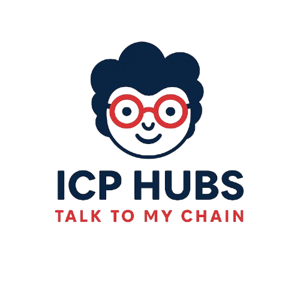

# ICPHub

**The Knowledge-Powered Community**

A decentralized platform that combines identity verification, knowledge sharing, and AI-powered interaction on the Internet Computer blockchain.



## 🎯 Vision Statement

ICPHub aims to become **"The Knowledge-Powered Community"** - a trusted ecosystem where verified community members can register unique identities, share and monetize knowledge, interact with AI using collective community knowledge, and access the ICP ecosystem through natural language interfaces.

## 🚀 Core Value Propositions

### 1. **Verified Identity Layer**
- 🔐 Seasonal domain name registration system with scarcity mechanisms
- 🌐 Internet Identity integration for secure, decentralized authentication
- 👥 Role-based access control (admin/user/guest) for community governance
- ⭐ Reputation and verification systems (planned)

### 2. **Knowledge Infrastructure**
- 📁 Personal data namespaces for each registered name
- 📄 Document storage and metadata management
- 🔗 File reference system with hash-based deduplication
- 🤖 Context Protocol integration for AI-powered knowledge access

### 3. **AI-Powered Interaction**
- 🛠️ Named and verified MCP (Model Context Protocol) servers for each registration
- 💫 Basic Context Protocol subscription included with name registration
- 💬 Natural language chat interface for canister interactions
- 🌍 Community-wide AI conversations using collective knowledge

### 4. **ICP Ecosystem Gateway**
- 🔌 Canister integration through DID file uploads
- 💭 Chat-based blockchain interaction (no technical knowledge required)
- 🎯 Direct canister communication via AI intermediary
- ✨ Simplified Web3 user experience

## 🏗️ Technical Architecture

### **Backend (Registry Canister)**
- **Enhanced Orthogonal Persistence** for safe, scalable upgrades
- **Seasonal lifecycle management** with time-bounded registration periods
- **Production-ready migration system** with automatic rollback capabilities
- **Rate limiting integration** to prevent cycle exhaustion attacks
- **Role-based security** with comprehensive access control

### **Frontend (React Application)**
- **Progressive Web App** with modern TypeScript architecture
- **Internet Identity** as primary authentication method
- **TanStack Query** for efficient state management and caching
- **Responsive design** with custom Tailwind CSS system
- **Event-driven navigation** for seamless user experience

## 💼 Business Model Innovation

### **Monetization Strategy**
- **Seasonal Registration Fees**: Scarcity-driven pricing model
- **Context Protocol Subscriptions**: Basic included, premium tiers available
- **Knowledge Marketplace**: Revenue sharing for valuable content
- **Governance Participation**: Token/reputation-based decision making

### **Growth Strategy**
- **Community-First Approach**: Build trust through verified contributions
- **AI-Enhanced UX**: Lower barriers to Web3 participation
- **Developer Ecosystem**: Easy canister integration tools
- **Knowledge Network Effects**: More members = more valuable conversations

## 🗓️ Development Roadmap

### **Phase 1: Foundation** ✅ (Current)
- ✅ Core registry system with seasonal management
- ✅ Internet Identity authentication
- ✅ Basic name registration and metadata storage
- ✅ Admin panel for season management

### **Phase 2: AI Integration** 🔄 (In Development)
- 🔄 Context Protocol MCP server deployment
- 🔄 Basic AI chat interface
- 🔄 Canister interaction via DID files
- 🔄 Rate limiting and security hardening

### **Phase 3: Community Features** 📋 (Planned)
- 📋 Reputation scoring system
- 📋 Governance mechanisms
- 📋 Knowledge marketplace
- 📋 Advanced AI capabilities

### **Phase 4: Ecosystem Integration** 📋 (Future)
- 📋 Multi-canister orchestration
- 📋 Cross-chain knowledge sharing
- 📋 Enterprise features
- 📋 Developer tools and APIs

## 🏆 Competitive Advantages

1. **First-Mover**: Unique combination of identity + AI + knowledge on ICP
2. **Technical Excellence**: Production-ready migration patterns and security
3. **User Experience**: Simplified Web3 interaction through AI
4. **Network Effects**: Knowledge sharing creates increasing value
5. **ICP Native**: Deep integration with Internet Computer capabilities

## 📊 Success Metrics
- **Growth**: Number of registered names and active users
- **Engagement**: AI conversation frequency and knowledge contributions
- **Trust**: Community reputation scores and verification rates
- **Revenue**: Subscription conversions and marketplace transactions
- **Technical**: System uptime, security incidents, and upgrade success rate

---

## 🛠️ Development Setup

### Prerequisites
- Node.js (v16+)
- DFX (Internet Computer SDK)

### Installation

1. Clone the repository:
```bash
git clone <repository-url>
cd icphub
```

2. Install dependencies:
```bash
# Frontend
cd frontend
npm install

# Backend
cd ../registry
npm install
```

### Development

#### Start Backend
```bash
cd registry
dfx start --background
dfx deploy
npm run status  # Check canister status
```

#### Start Frontend
```bash
cd frontend
npm run dev  # Starts on http://localhost:5173
```

### Key Commands

#### Frontend
- `npm run dev` - Start development server
- `npm run build` - Production build
- `npm run lint` - Run ESLint
- `npm run typecheck` - TypeScript checking

#### Backend
- `npm run deploy` - Deploy canister
- `npm run upgrade` - Upgrade canister (preserves data)
- `npm run status` - Check canister status
- `npm run seasons` - List all seasons

### Initial Setup

1. Deploy the backend canister
2. Initialize access control (first caller becomes admin):
```bash
dfx canister call context_registry initializeAccessControl
```
3. Start the frontend and connect with Internet Identity

## 📁 Project Structure

```
icphub/
├── frontend/          # React TypeScript application
│   ├── src/
│   ├── public/
│   └── package.json
├── registry/          # Motoko backend canister
│   ├── src/
│   └── package.json
└── CLAUDE.md         # AI assistant documentation
```

## 🤝 Contributing

We welcome contributions! Please see our [Contributing Guidelines](CONTRIBUTING.md) for details.

## 📄 License

[License information here]

---

**Built with ❤️ using [caffeine.ai](https://caffeine.ai) on the Internet Computer**

*ICPHub - Where AI meets Community on the Blockchain*